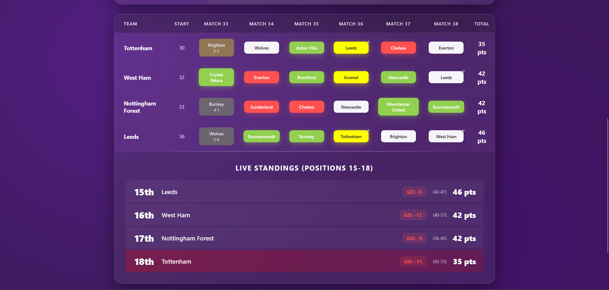

# Premier League Relegation Tracker ⚽

An interactive web application to simulate and track the Premier League relegation battle for positions 15-18.

## 🌟 Features

- **Two Modes**: Standard (W/D/L) and Advanced (exact scores)
- **Real-time Updates**: See how each result affects the table
- **Goal Difference Tracking**: Advanced tiebreaker calculations
- **Head-to-Head Logic**: Linked matches update automatically
- **Beautiful UI**: Dark mode with smooth animations
- **Mobile Responsive**: Works on all devices

## 📸 Screenshots

## 🛠️ Technologies Used

- HTML5
- CSS3 (with animations)
- Vanilla JavaScript
- No external dependencies

## 💡 How to Use

1. Choose between Standard or Advanced mode
2. Click on fixtures to set results
3. Watch the live standings update automatically
4. In Advanced mode, enter exact scores for goal difference calculations

## 🤝 Contributing

Feel free to fork this project and submit pull requests for improvements!

## ⭐ Support

If you find this useful, please give it a star!
